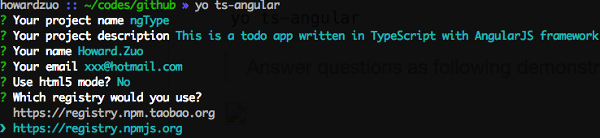
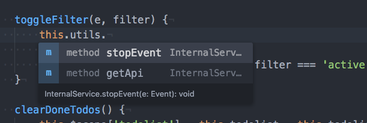
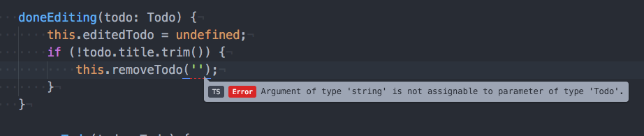
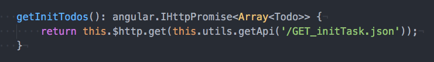

# generator-ts-angular
==================

[![NPM version][npm-image]][npm-url]
![][david-url]
![][dt-url]
![][license-url]

Yeoman generator for TypeScript based AngularJS project skeleton.
>[webpack](http://webpack.github.io/) was chosen as default bundle tool, and `npm scripts` is used for providing easy use/less dependency building tools

> You can view the online demo at: [http://leftstick.github.io/generator-ts-angular](http://leftstick.github.io/generator-ts-angular)

## Prerequisites ##

1. Install [yeoman](http://yeoman.io/): `npm install -g yo`
4. Install __this__: `npm install -g generator-ts-angular`

> prepend with `sudo` if you are running on `*nix` OS.

## Use `generator-ts-angular` ##

`yo ts-angular`

> Answer questions as following demonstrated

And then, the [TypeScript](http://www.typescriptlang.org) based project generated.

## Quick start ##

### Debug your app ###

The full featured `dev/dist` tools are provided, it's easy to start debugging your app.

Just move into the created directory with the given `project name`.

Run `npm start` to start a debug web server for the project.

Open [http://localhost:8080/](http://localhost:8080/) to see the playable skeleton, and have fun.

### Release your app ###

Move the root of the created project.

Run `npm run release` to compile all the source code into webpack bundles. And all required resources are generated into `{root}/build/`.

You can copy the `build` folder to anywhere you like, it's the released app.

#### Like have a try with the released app? ####

Install [sero-cli](https://github.com/leftstick/Sero-cli): `npm install -g sero-cli`

Move into `{root}/build/`

Run `sero server -p 8080 -h`, a static web server launched at port 8080.

Open [http://localhost:8080](http://localhost:8080) to watch the released version.

**I would strongly suggest that you use [atom](https://atom.io/) with [atom-typescript](https://atom.io/packages/atom-typescript) plugin to modify the codes. That's really fantastic experience.**

#### Autocomplete ####

#### Live error analysis ####

#### Generics ####

## More read ##

Looking for detail? Check it [here](https://github.com/leftstick/generator-ts-angular/blob/master/docs/api.md)

## LICENSE ##

[MIT License](https://raw.githubusercontent.com/leftstick/generator-ts-angular/master/LICENSE)

[npm-url]: https://npmjs.org/package/generator-ts-angular
[npm-image]: https://badge.fury.io/js/generator-ts-angular.png
[david-url]: https://david-dm.org/leftstick/generator-ts-angular.png
[dt-url]:https://img.shields.io/npm/dt/generator-ts-angular.svg
[license-url]:https://img.shields.io/npm/l/generator-ts-angular.svg
